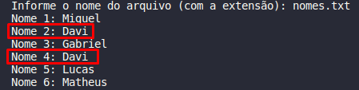
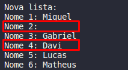

# Exercicios-de-Lista-Ativ2

<h2>Problema 2.1</h2>

Crie uma lista linear que consiga armazenar um conjunto de 100 nomes quaisquer, os quais serão salvos de forma aleatória. Feito a estrutura crie as seguintes ações:
<li>Uma função que consiga identificar replicações na lista, ou seja, nomes iguais. Remova todas as réplicas sem mover os ”ponteiro“.

<h3>Resolução</h3>

A resolução deste problema consiste em:
<li>Ler um número X de nomes de um arquivo chamado "nomes.txt" e verificar se esse arquivo existe e não está vazio;</li>
<li>Caso a lista não esteja vazia e exista, o método "Replicacao" é chamado dentro do método "lerArquivo" com o intuito de detectar possíveis repetições;</li>
<li>Primeiramente, o método "Replicacao" verifica se a lista está vazia, em seguida verifica se existem nomes repetidos dentro da lista. Caso exista, ele o identifica e insere um "\n" no local;</li>
<li>A saída é a própria lista lida, porém sem os nomes replicados na sua primeira aparição.</li>

<h2>Problema 2.2</h2>

Como você gerenciaria os espaços em branco para novas inserções? Qual seria o custo dessas novas inserções?

<h3>Resolução</h3>

Os espaços em branco são facilmente encontrados por não haver nada dentro dessa posição, logo não é difícil substituir os mesmos por outros nomes. O custo dessas novas inserções seria de n, pois a lista é percorrida uma única vez buscando posições vazias.

<h2>Compilação e Execução</h2>

O progama disponibilizado possui um arquivo Makefile que realiza todo o procedimento de compilação e execução. Para tanto, temos as seguintes diretrizes de execução:

| Comando                |  Função                                                                                           |                     
| -----------------------| ------------------------------------------------------------------------------------------------- |
|  `make clean`          | Apaga a última compilação realizada contida na pasta build                                        |
|  `make`                | Executa a compilação do programa utilizando o gcc, e o resultado vai para a pasta build           |
|  `make run`            | Executa o programa da pasta build após a realização da compilação                                 |
